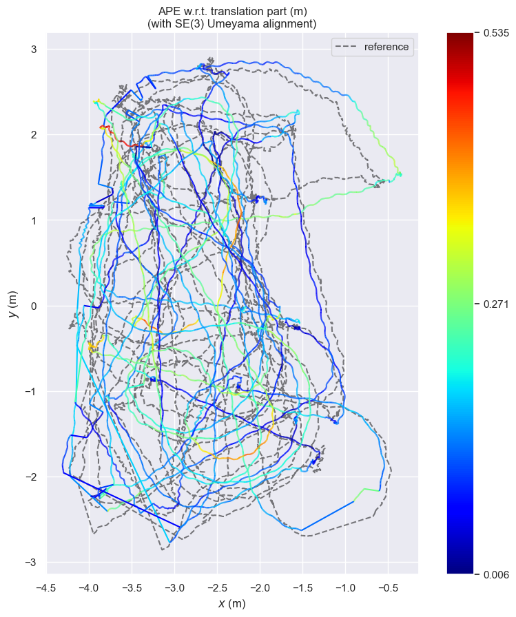
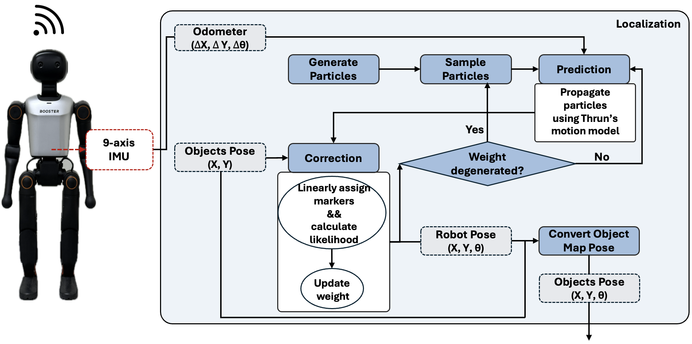

# 📍 INHA Localization
**Probabilistic Self-Localization for Humanoid Soccer**

*Robust Global Localization • Symmetry-Aware Estimation • Vision-Odometry Fusion*

---
## Problem Statement

**Humanoid soccer localization is inherently ill-posed.**

Compared to wheeled robots, humanoids suffer from:
- Severe odometry drift due to foot slippage and impacts
- Highly ambiguous observations caused by **field symmetry**
- Sparse and unreliable landmarks under occlusion and motion blur

In RoboCup-style fields, multiple poses can explain the same visual observations.
A robust localization system must therefore:
1. **Maintain multiple pose hypotheses**
2. **Resolve symmetric ambiguities over time**
3. **Remain stable under partial or noisy measurements**

**INHA Localization** addresses these challenges using a  
**probabilistic, multi-hypothesis estimation framework**.

---

## Core Algorithm Overview

INHA Localization employs an **adaptive particle filter (SIR)** that fuses:
- Odometry-based motion prediction
- Vision-based field marker observations
- Assignment-aware likelihood evaluation
- Temporal consistency mechanisms

Rather than collapsing prematurely, the system maintains multiple hypotheses
until sufficient evidence supports convergence.

---

## Key Design Choices & Differentiators

### ▸ Assignment-Aware Measurement Modeling

Detected field markers (L, T, X, goal posts) are associated with map landmarks
using a **global one-to-one assignment** solved by the **Hungarian algorithm**.

- Prevents duplicated landmark assignments  
- Naturally handles partial and unordered observations  

Measurement likelihood is evaluated using a **distance-anisotropic Gaussian model**:
- Residuals are decomposed into **radial** and **tangential** components  
- Uncertainty scales with landmark distance  

This yields robust, geometry-aware likelihood evaluation under sparse observations.

---

### ▸ Adaptive Hypothesis Management via ESS-Controlled Resampling

The filter monitors **Effective Sample Size (ESS)** to detect weight degeneracy.

- Resampling is triggered only when necessary  
- Preserves multi-modal hypotheses under symmetry  
- Enables rapid convergence when observations become informative  

---

### ▸ Reference-Guided Pose Finalization with Temporal Gating

Pose estimation is formulated as a **temporal consistency problem**.

- **Initialization**: select the highest-weight particle to avoid unstable averaging  
- **Tracking**: apply position and orientation gating relative to the previous pose  
- **Estimation**: compute a weighted mean if sufficient consensus exists,  
  otherwise fall back to the maximum-weight hypothesis  

The final pose is stabilized using **orientation gating** and **EMA smoothing**,
enabling symmetry resolution through time rather than instantaneous clustering.

---
## Performance Evaluation

Localization accuracy was evaluated using **Absolute Pose Error (APE)** with  
**SE(3) Umeyama alignment** in half court condition.

   

### Δ Translation Error (meters)

| Metric | Value |
|------|------:|
| Mean | **0.17 m** |
| Median | 0.15 m |
| RMSE | 0.19 m |
| Max | 0.54 m |

> Evaluation over **153,555 poses**,
> **203 m trajectory**, **455 s duration**

---
## System Architecture

---

    <b>Built by INHA United</b> 
    <i>Pushing the boundaries of Autonomous Soccer</i>

